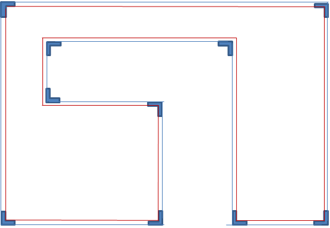

# xonix2d

## 1. Description
- **Set 1**. A boundary in the middle
- **Set 2**. Three balls inside the boundary, continuously moving
    > **2.1**. When three balls meet the boundary, bounce off
- **Set 3**. An enemy above the boundary
    > **3.1**. An enemy can be moved by a keyboard
  
    > **3.2**. An enemy can enter the boundary but not go outside the boundary

- If the enemy that **moves out of the boundary**, a trajectory is created.
- If the enemy moves out of the boundary and **returns**, the trajectory is included in the boundary.
- If the trajectory meets one of the balls before the trajectory is included in the boundary, game ends.

## 2. Created Objects
- Boundary
  - variable : vertex
  - function
      - Is the given position above the boundary?
      - 
  - 
- A Ball which moves inside the boundary
- A Ball which moves outside the boundary
